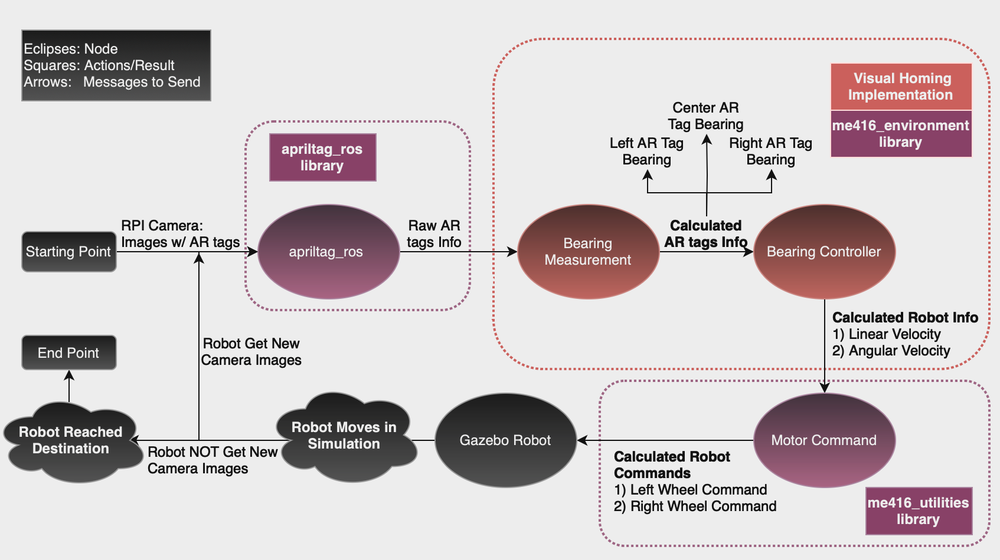

# Project: Autonomous Driving Simulation
## Method: Bearing Only Visual Homing using 2-D Unicycle Model
PI: Roberto Tron
Author: Hairuo Sun
Date: 11/11/2023

## Summary
The goal of this project is to create an autonomous driving simulation in Gazebo for a robot to: 1) drive autonomously on an unmarked terrain, and 2) drive through a simulated AR gate with fiducial tags solely based on camera image anlysis for localization. 

The context of this project is to simulate a Mars rover autonomous traversal task on Mars when navigating the Mars Base Station.

## Paper
* [Bearing-Only Visual Homing with Applications to a 2D Unicycle Model](https://drive.google.com/file/d/1WIOy5xXWTZDirO3twJEIU080zSkGeYzU/view?usp=share_link)

### Project Deliverables/Functionalities
* Camera: Able to identify all Fiducials in the scene and record each gatepost's position.
* 3D vehicle: respond to motor control for left/right turn with controlled speed.
* Overall Result: A 3D vehicle is able to traverse through an AR gate (with fiducial on all gateposts for gate localization) in a Gazebo simulation.

## Solution Design

 SW Solution Design 

 
 
 

## Setup
* Download the source code from this repo.
* Run the code in a Linux based OS.
* Build 2 packages:
  * Create your own "ros_ws" folder, and cd to this folder
  * catkin build

## Execution
* Launch the me416_environment world:
  * Run in terminal: roslaunch me416_environment me416_environment.launch
* Launch the camera recording:
  * Run in terminal: rosrun rqt_image rqt_image
  * Place the rover at a location where camera can see both images
* Launch the continuous_detection script:
  * roslaunch apriltag_ros continuous_detection_test.launch
* Observe the rover behaviors:
  * if the "2 apriltag (on 2 gateposts)" system is selected --> rover will drive towards the gate & stop right before the gate.
  * if the "2 apriltag (on 3 gateposts)" system is selected --> rover will drive through the gate & stop right before the furtherest gate in the middle.

## DEMO Videos
* [Visual Homing in Gazebo Simulation - using 3 Tag](https://youtu.be/CaGOPrl82sU)

## Technical Components
### Linux System
* [VMWare Workstation(virtual machine)](https://www.vmware.com/products/workstation-player.html)
* [Ubuntu OS](https://ubuntu.com/desktop)

### SW Components/Libraries
* [ROS](https://www.ros.org)
* [Gazebo](https://gazebosim.org/home)
* [apriltag_ros](https://github.com/AprilRobotics/apriltag_ros)
* [me416_environment](./Working%20ME416%20Ccode%20for%20Autonomous%20Navigation(work%20with%203%20apriltags)%206_27_2023/me416_environment/)
* [me415_lab](./Working%20ME416%20Ccode%20for%20Autonomous%20Navigation(work%20with%203%20apriltags)%206_27_2023/me416_lab/)
* [ROS library - geometry_msgs](http://wiki.ros.org/geometry_msgs)
* [squaternion](https://pypi.org/project/squaternion/)
* [numpy](https://numpy.org/install/)

## Other Sketches and photos (detailed design diagrams, setup images, terminal screen output, etc)
* TBD

## References (includes any papers, datasheets, forum posts, tutorials, debug site links, articles used during the project completion process, tutorials)
### Datasheets
* [Flexible Layouts for Fiducial Tags (as reference)](https://drive.google.com/file/d/102KAxCEt4zkZZcp7ROOogLyKw8SXv0Te/view?usp=sharing)
* [ROS Tutorials](http://wiki.ros.org/ROS/Tutorials)

## Future Improvements:
* For Simulation:
 * Investigate some edge cases when the robot drive towards deadend of the tags.
 * Create 3 surfaces for each gatepost to allow the robot camera see at least 2 tags at all times.
* For a physical robot (in real life):
 * Transfer the Simulation Code onto a physical ROSBot.
 * Create a physical DEMO terrain to drive the robot autonomously. 
